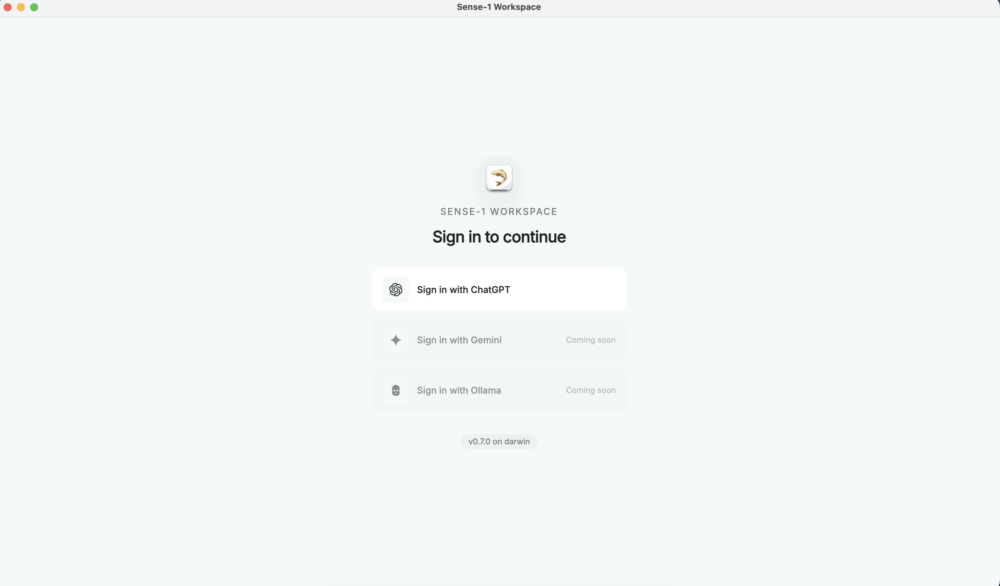
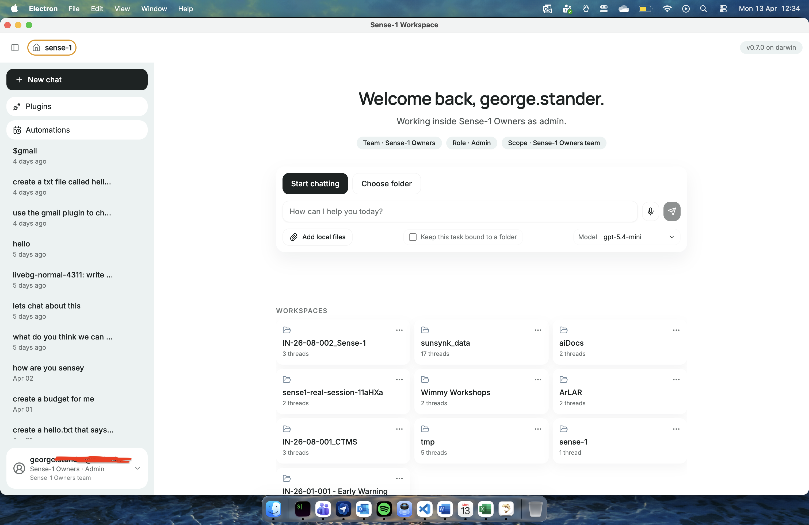
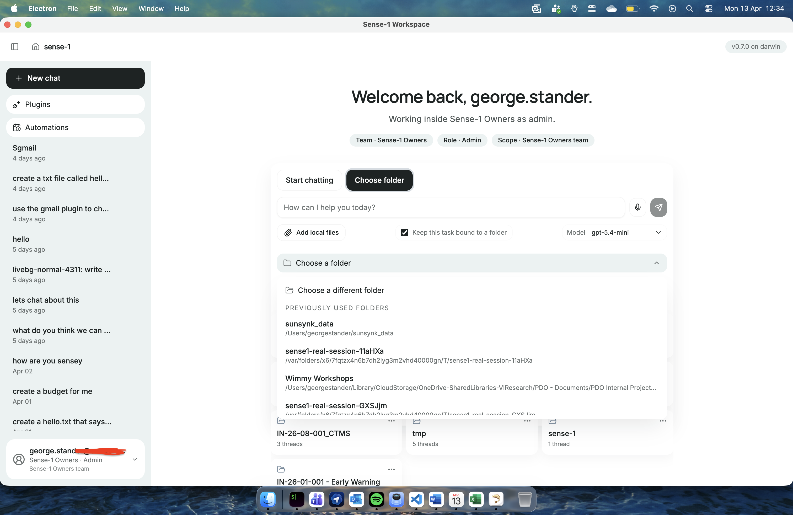
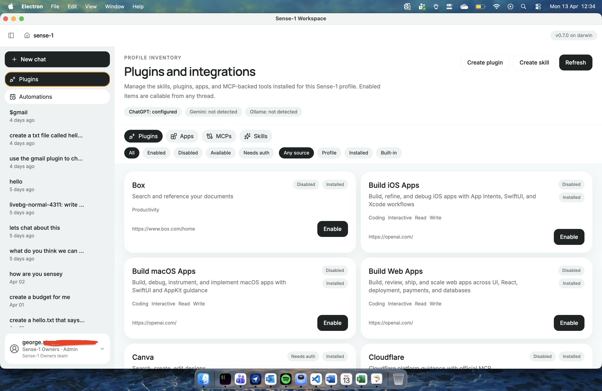
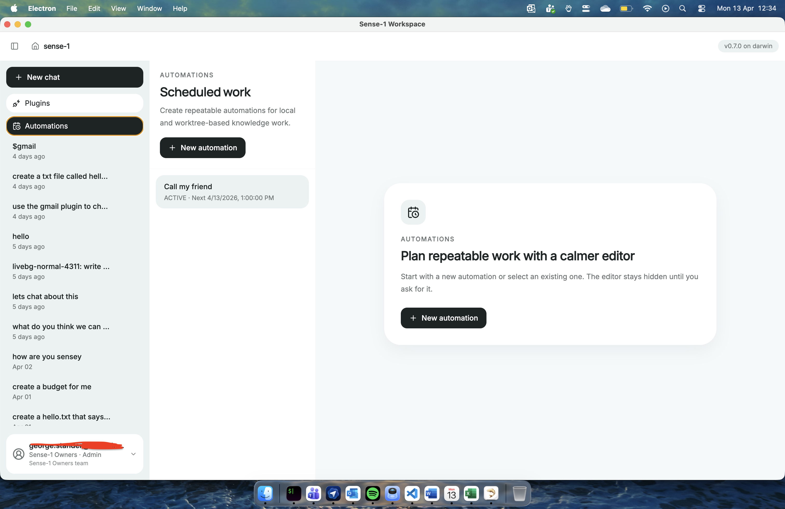

<p align="center">
  
</p>

# Sense-1 Workspace

An open-source desktop AI workspace built on [OpenAI's Codex app server](https://github.com/openai/codex). Local folder-bound sessions for working with AI on your files.

Who needs the upcoming ChatGPT super app?

## Why Codex app server?

Most desktop AI tools wrap an HTTP API and call it a day. Sense-1 Workspace runs the actual Codex app server as a supervised local process — the same runtime that powers Codex itself. That means you get the real thing, not a watered-down proxy:

- **Native plugins and skills** — install and manage Codex plugins, skills, and apps directly from the desktop shell
- **MCP servers** — connect Model Context Protocol servers for tool use, file access, and external integrations without leaving the app
- **Governed approvals** — file changes, command execution, and permissions go through the same approval model Codex uses
- **Operating modes** — switch between Preview, Auto, and Apply to control how much autonomy the runtime gets
- **Local-first sessions** — threads, artifacts, and workspace state stay on your machine, scoped to your folders
- **Automations** — schedule and manage recurring tasks with cron-style rules, bound to specific workspaces

This isn't a chat wrapper. It's a native desktop workspace that treats the Codex runtime as a first-class execution engine.

## What it looks like

<table>
<tr>
<td></td>
<td></td>
</tr>
<tr>
<td></td>
<td></td>
</tr>
</table>

## Features

- Start a chat session immediately or bind it to a local folder
- Full plugin, skill, app, and MCP server management
- Workspace-scoped threads with persistent state across restarts
- Desktop approvals for file writes, commands, and permissions
- Automations with cron scheduling and workspace binding
- Configurable operating modes and agent behavior
- Native Electron shell — not a browser tab pretending to be an app

## Stack

| Layer | Technology |
|:---|:---|
| Runtime | [Codex app server](https://github.com/openai/codex) (Apache 2.0) |
| Desktop | Electron |
| UI | React 19, Tailwind CSS 4, Lucide icons |
| Language | TypeScript |
| Design | [The Governed Atelier](DESIGN.md) |

## Quick start

```bash
# Prerequisites: Node.js 22+, pnpm 9+, Codex CLI installed
pnpm -C desktop install
pnpm -C desktop dev:full
```

`dev:full` starts the Electron shell and the Codex app server together. Make sure [Codex](https://github.com/openai/codex) is installed and available on your PATH.

## Commands

```bash
pnpm -C desktop dev              # Electron shell only (renderer hot-reload)
pnpm -C desktop dev:full         # Full desktop with Codex runtime
pnpm -C desktop typecheck        # TypeScript type checking
pnpm -C desktop test:unit        # Unit tests (main + renderer)
pnpm -C desktop build            # Build all bundles
pnpm -C desktop check:structure  # Desktop structure lint
```

## Repo layout

```text
desktop/       Electron app (main process, preload bridge, renderer)
DESIGN.md      Visual design system specification
CONTRIBUTING.md   Contribution guidelines
```

## Background

Sense-1 Workspace has been in active development as a private project since early 2026. This is the first public release — the desktop workspace layer extracted and open-sourced for the community to use, fork, and build on.

The broader Sense-1 product continues as a separate effort focused on turning business processes into usable software for small teams.

## Contributing

See [CONTRIBUTING.md](CONTRIBUTING.md) for guidelines.

## License

[Apache 2.0](LICENSE)
